Completar la url donde se ejecute tu servidor de forma local (en el archivo cliente.py).

Abrir dos terminales, una terminal para el servicor y otra para el cliente.

En la terminal para el cliente correr el comando python cliente.py.
Deberá aparecer en la terminal lo siguiente:

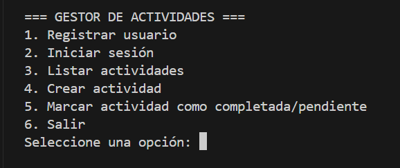

En la terminal para el servidor correr el comando python servidor.py.

Mientras que en la consola del servidor, se mostrará que empezó a correr el servidor y a medida que interaccione el cliente con el servidor, se mostrarán estos mensajes:

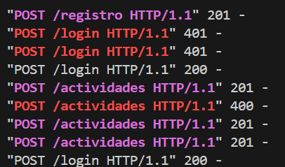

-Registro de usuario
Para registrar un usuario debemos seleccionar la opción 1.
Deberá ingresar su nombre de usuario (no debe tener menos de seis caracteres) y la clave (que debe contar con al menos ocho caracteres) para el registro. 

En caso de que el usuario cuente con menos de los caracteres correspondientes se muestra el siguiente mensaje por consola: "El usuario debe tener al menos seis caracteres"

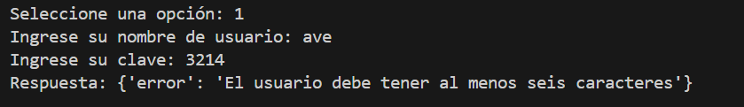

En caso de que la clave cuente con menos caracteres que los correspondiente se muestra el siguiente mensaje por consola "La clave debe tener al menos ocho caracteres".

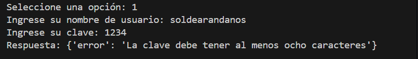

En el caso de que el usuario cumpla con las dos verificaciones, el mensaje que aparecerá por consola es el siguiente "Usuario registrado correctamente".

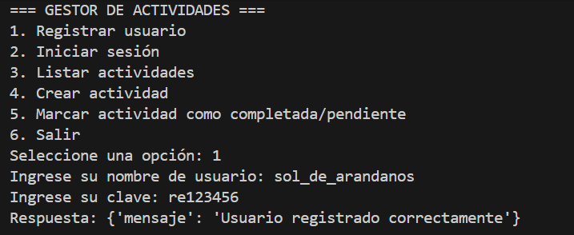

En el caso de que se quiera registrar un nuevo usuario con un nombre de usuario ya registrado, el mensaje que aparecerá por consola es el siguiente "El usuario ya existe".

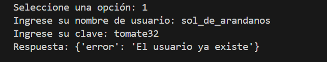

En cambio si el usuario no existe, se registrara el nuevo usuario de forma correcta.

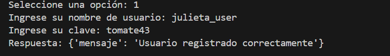

-Inicio de sesión

En el caso de que una de las credenciales sea incorrecta, por consola se mostrará el mensaje "Credenciales inválidas"

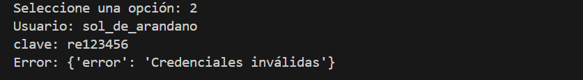

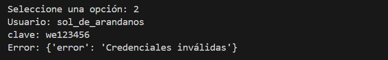

Caso contrario, si el usuario coloca de forma correcta su usuario y contraseña, por consola se la mostrara el siguiente mensaje "Login exitoso".

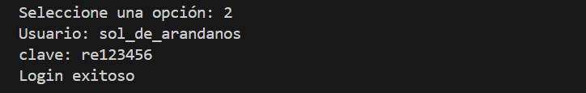

-Crear actividad

Tener en cuenta que esta opción solo funciona si tenemos un usuario logueado. Por eso se recomienda revisar el apartado Inicio de sesión .
Luego de iniciar sesión con su usuario, puede crear la actividad. Se debe tener en cuanta que la descripción de la actividad debe tener un mínimo de quince caracteres. En caso de que se cumpla este punto, por consola aparecerá el mensaje "Actividad creada con éxito".

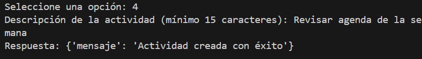

Caso contrario aparecerá un mensaje por consola que nos dice "La descripción debe tener al menos 15 caracteres"

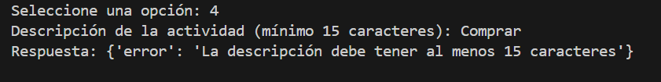

-Listar actividad

Nos muestra el listado de actividades

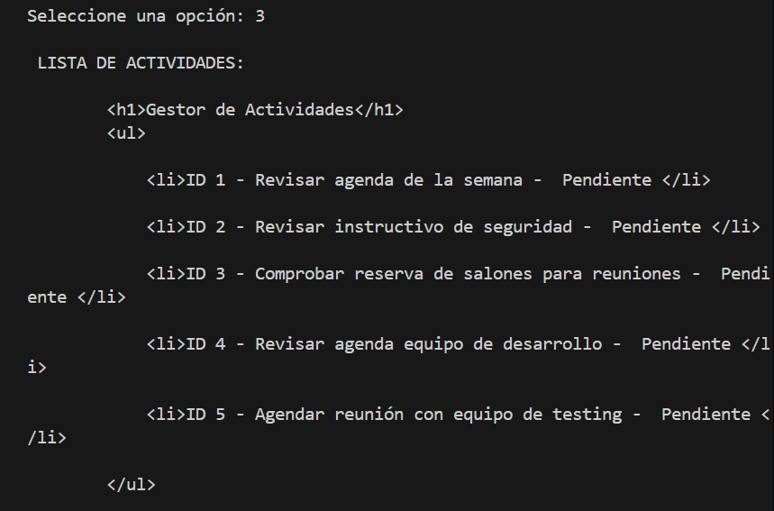

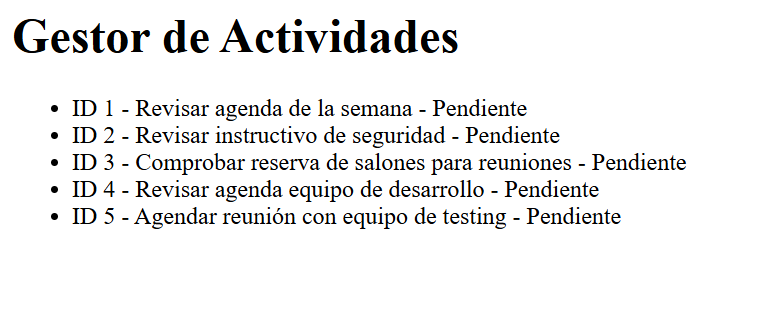

-Marcar actividad como completada/pendiente

Para completar una actividad como completada o pendiente, lo que se debe hacer es seleccionar el ID de la actividad a marcar y luego responder por consola "s" si está completada o "n" si está pendiente. Si está completada, aparecerá el mensaje "Actividad completada". Por el contrario, si la actividad sigue pendiente el mensaje por consola será "Actividad marcada como pendiente".

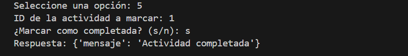

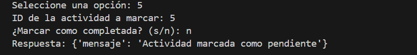

En caso de que se seleccione el ID de una actividad que no exista, el mensaje que se muestre por consola será el de "Actividad no encontrada".

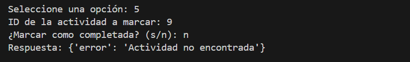

-Salir

Para que el usuario termine la interacción debe seleccionar la opción 6 y por consola aparecerá el mensaje "Saliendo... "

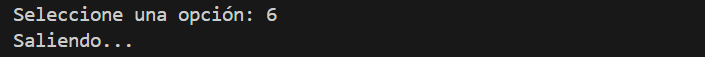

Para terminar las ejercuciones de las terminales se recomienda utilizar el comando Ctrl + C.

Se suman una imagen de como se guardan en la base de datos las claves:

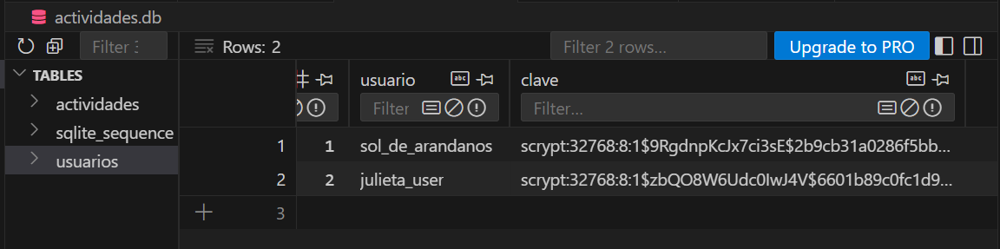

y las actividades:

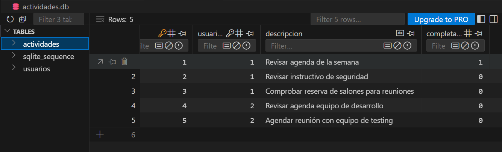